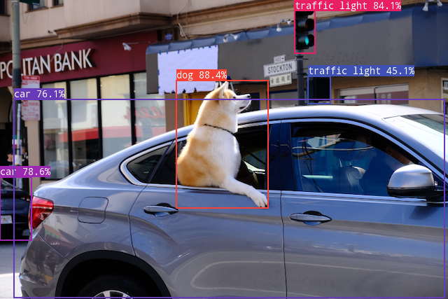

# ncnn-yolov7-risc-v
A simple CMake project for performing object detection with yolov7 on the RISC-V Allwinner D1 with vector instructions (RVV). 

<p align="center">
    
</p>

## How to install

Clone the repository:
```shell
git clone https://github.com/vassilijnadarajah/ncnn-yolov7-risc-v.git
cd ncnn-yolov7-risc-v
```

### Install for Allwinner D1 (RISC-V) with and without RVV support

Download the C906 toolchain from [XuanTie](https://xuantie.t-head.cn/community/download?id=4224193099938729984) and unpack it in the toolchain directory.
```shell
mkdir -p ${HOME}/toolchains
tar xvf Xuantie-900-gcc-linux-5.10.4-glibc-x86_64-V2.6.1-20220906.tar.gz -C ${HOME}/toolchains
```

Set the `RISCV_ROOT_PATH` environment for CMake to be able to find the compiler toolchain.
```shell
export RISCV_ROOT_PATH=${HOME}/toolchains/Xuantie-900-gcc-linux-5.10.4-glibc-x86_64-V2.6.1
```

Create a build directory and build the project with RVV enabled. 
To disable RVV set `DRVV_ENABLED=OFF`.
```shell
mkdir -p build-c906
cd build-c906
cmake -DCMAKE_TOOLCHAIN_FILE=../toolchains/c906-v226.toolchain.cmake DRVV_ENABLED=ON..
cmake --build . -j 2
```

Make sure to copy the `resources`-directory into the same directory as the `ncnn-yolov7-risc-v` executable, since it includes the model files. 

Test the executable with
```shell
./ncnn-yolov7-risc-v resources/pics/dog.png
```

### Install for Raspberry Pi Zero 2 (ARMv8) with and without NEON support
ToDo